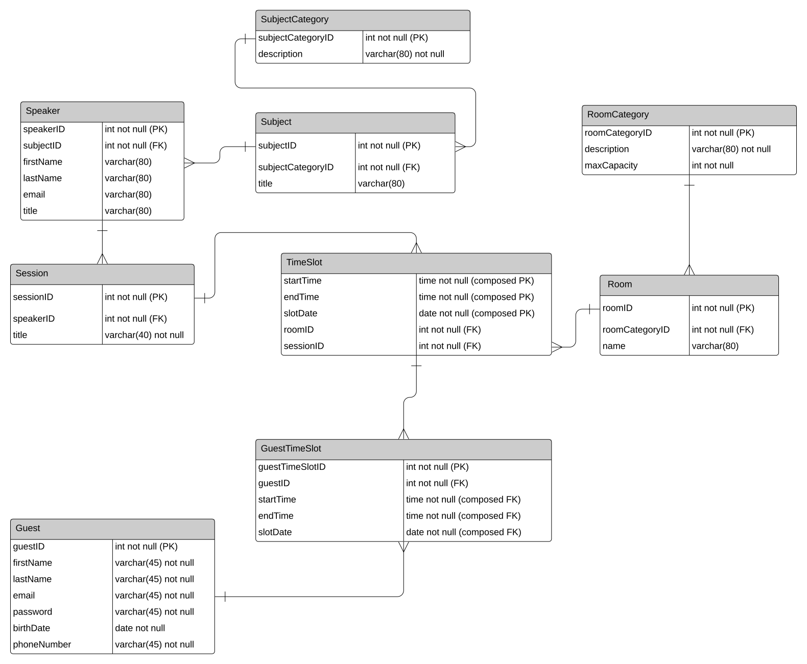
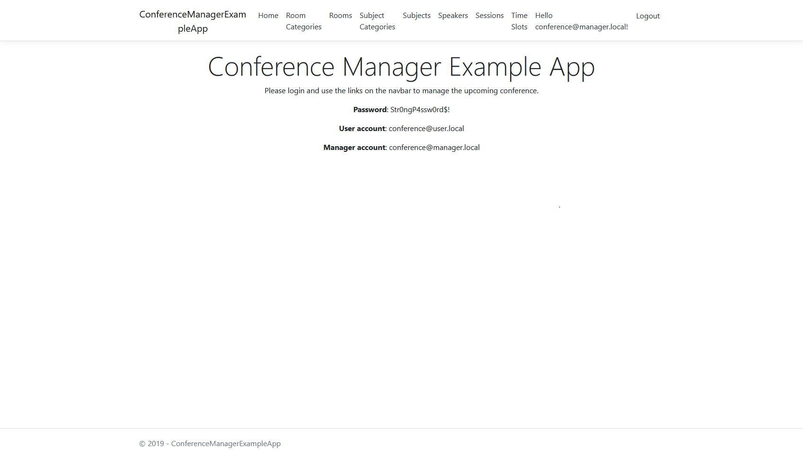
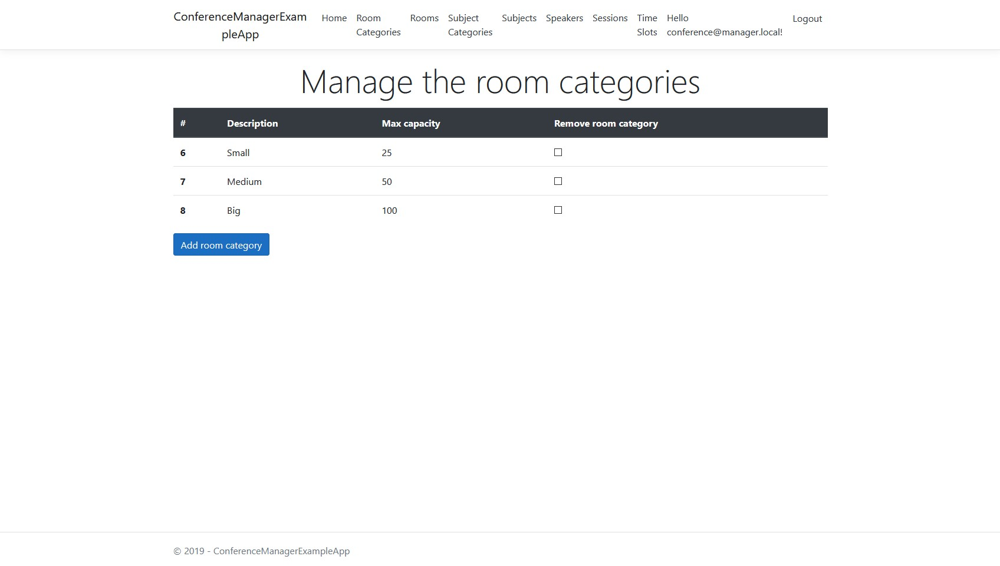
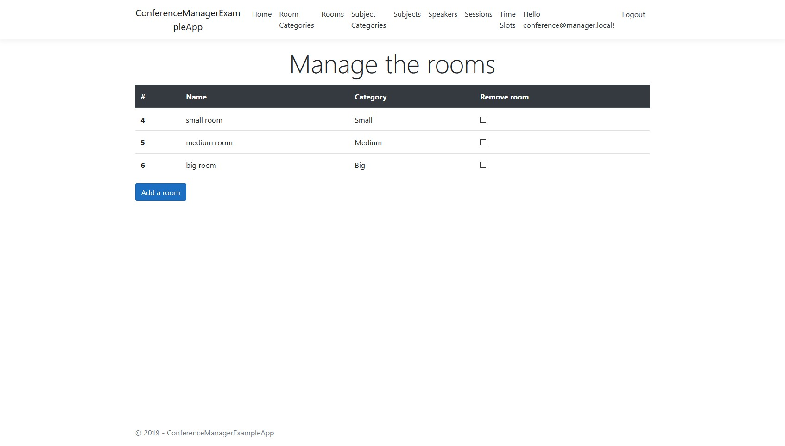
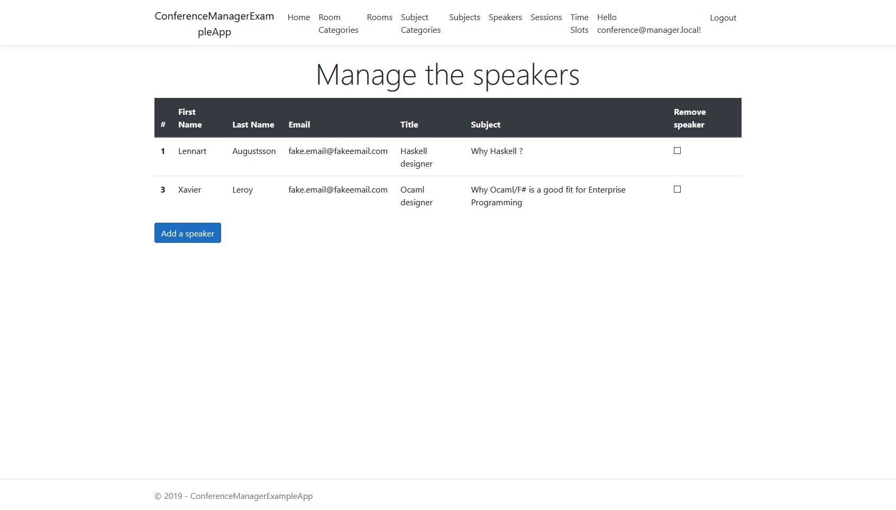
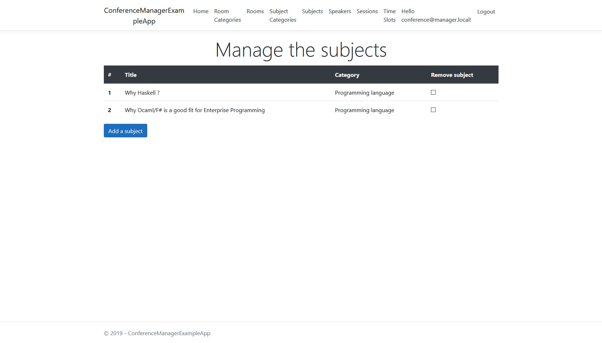
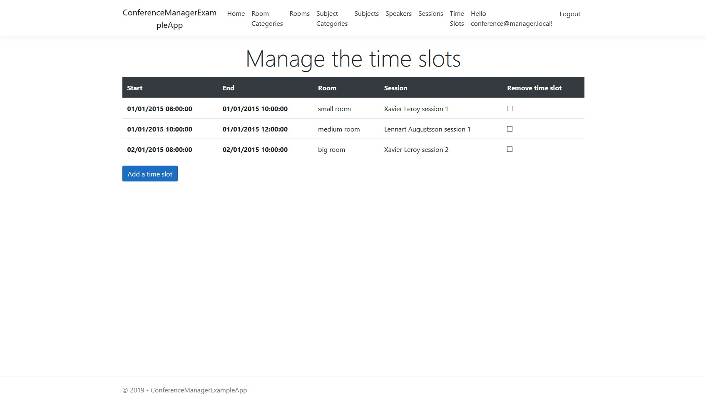
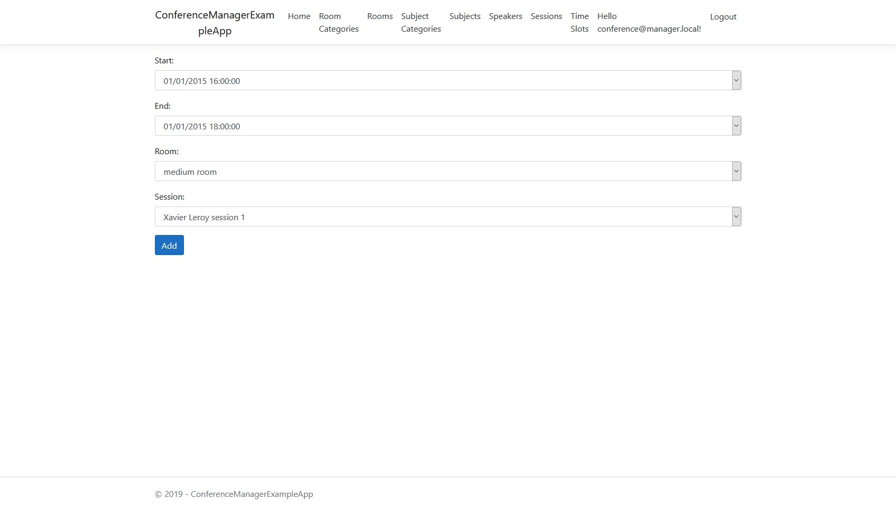
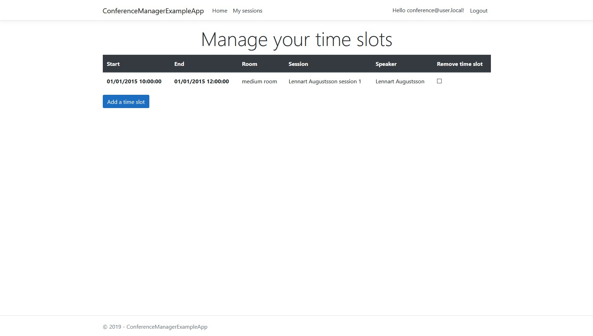
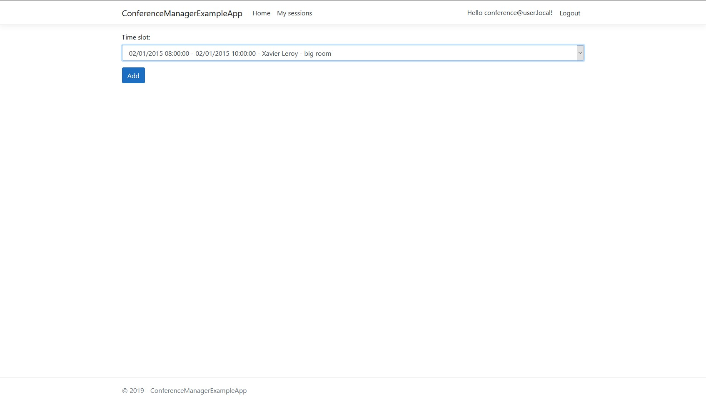

# Conference Manager Example App

This ASP.NET Core 3.0 sample application allows a *conference manager* to register the:

- Room categories
- Rooms
- Conference's subject categories
- Conference's subjects
- Speakers
- Conference's sessions
- Guests
- Time slots

It also allows a *user* to select the sessions he wants to assist to.

## Main technical difficulty

The main technical difficulty with this database is the time slot constraint:

**A time slot has only ONE session in ONE room. It is impossible for two sessions to share the same time slot.**

This constraint is implemented by the composite key in the TimeSlot table
and the many-to-one relationships between TimeSlot and Session/Room.

## The database

The application implements the following Entity-Relationship diagram:

## Screenshots

Home page:

List of room ctaegories:

List of rooms:

List of speakers:

List of Subjects:

List of time slots:

Form to add a time slot:

List of time slots a user can subscribe to:

Form used by an user to subscribe to a session:

